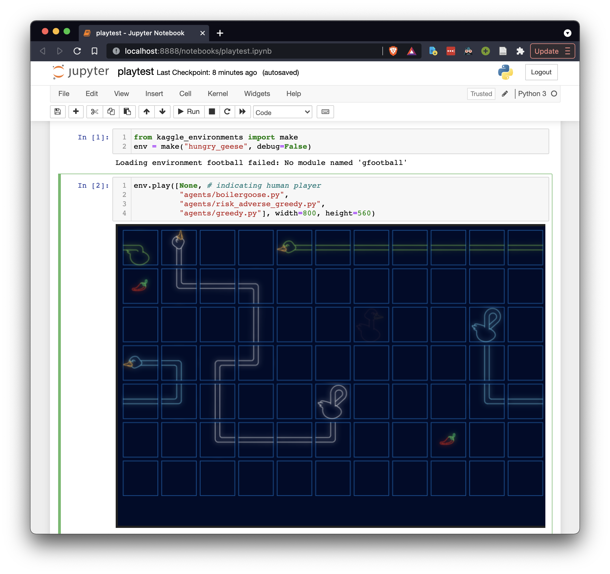

Please refer to the main [repository](https://github.com/Kaggle/kaggle-environments) to understand what Kaggle Environment is about.

Our report is available on [link]().

Following contains the steps to set up the GUI

- Clone the Github repository `git clone https://github.com/tinkitwong/kaggle-environments`.
- Navigate into directory of the repository
- Create a python Virtual Environment `python3 -m venv env`
- Activate Virtual Environment `source env/bin/activate`
- Install Dependencies `pip install requirements.txt`
- Start the Jupyter server `jupyter notebook`
- Navigate into notebook `playtest.ipynb`
- Run the first two cells of the notebook

If your setup is successful, you should be able to play the game. Your agent is in white.

You can choose the agents to play against. If the agent can be submitted into the Kaggle competition, you can play against the agent here.

We offer the following agents to play against
- `simple_toward.py` - This is [a sample submission](https://www.kaggle.com/c/hungry-geese/overview/rules-of-play) by the competition organisers published in the competition rules. The goose simple chooses the action that moves towards the closest food, without any constraints.
- `greedy.py` - This is [another sample submission](https://github.com/Kaggle/kaggle-environments/blob/d1b52004fbc23af568f4867e3ef7b64144df165e/kaggle_environments/envs/hungry_geese/hungry_geese.py#L121) by the competition organisers published in the kaggle environment repository. The goose simply chooses the action that moves towards the closest food, but with contraints that the next move will not result in a death.
- `straightforward_bfs.py` - [The agent](https://www.kaggle.com/ihelon/hungry-geese-agents-comparison) uses breadth-first search to find the shortest path to the food while avoiding obstacles. Other agents are assumed to be stationary during the search.
- `crazy_goose.py` - [The agent](https://www.kaggle.com/gabrielmilan/crazy-goose) first employ a greedy strategy to grow to a length of 4. When that is achieved, the goose will rotate in position.
- `risk_adverse_greedy.py` - [The agent](https://www.kaggle.com/ilialar/risk-averse-greedy-goose) will mark all cells that can be dangerous on the next step as obstacles, and find the shortest route to the nearest food item.
- `boilergoose.py` - [The agent](https://www.kaggle.com/superant/mighty-boilergoose-with-flood-fill) uses a flood-fill algorithm is used to find if it is able to reach a food before the others. When a certain length is reached, it will maintain its length and follow its tail.
- `pubhrl.py` - [The agent](https://www.kaggle.com/yuricat/smart-geese-trained-by-reinforcement-learning) uses a neural network model inspired by AlphaGo to make prediction. The team use an [IMPALA-like training architecture](https://github.com/DeNA/HandyRL) they wrote to train the agent.
- `alphageese-baseline.py` - [The agent](https://www.kaggle.com/shoheiazuma/alphageese-baseline) uses the pubhrl model architecture and model parameters, but with a Monte Carlo Tree Search to simulate the game. The agent can score very close to the bronze medal boundary.
- `alphageese-imitation.py` - [The agent](https://www.kaggle.com/shoheiazuma/alphageese-simple-solution) submitted by the alphageese-baseline author. It uses the same model architecture, but the model is trained against the moves made in best agents in the publicised gameplay in the leaderboard. The agent can score very close to the gold medal boundary.
- `v13.py`, `v14.py`, `v17.py`, `v32.py` - Variants of AlphaGeese that is created by us. Please refer [our report]() for our elaboration on our agents.

Please note that if you are playing against any of the AlphaGeese agents, the computation will take seconds due to Monte Carlo Tree Search.
